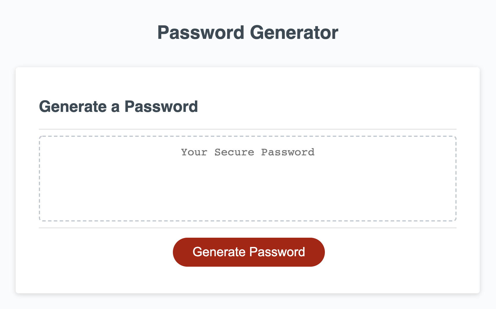

# Presenting: Code Generator 2021

## Description

Please find here the code generator. It has been created to practice js skills. Userinteraction happens via a series of promts to let the user influence the creation of his/her preferred random password.

## Screenshot

## Relevant Links

Please find the relevant links here:

* Live - Website on Github.io: [Click Here](https://alexanderpuschkinberlin.github.io/Code-Generator-2021/)

* Repository on Github: [Click Here](https://github.com/alexanderpuschkinberlin/Code-Generator-2021)

- - -
© 2021 Alexander Puschkin | All Rights Reserved.